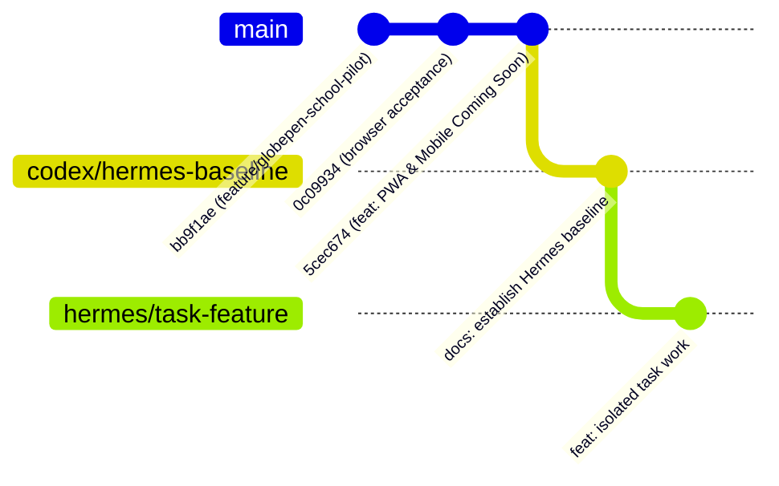

# GlobePen — Canonical Project Handoff & Architecture Baseline

This document records the official transition of the **GlobePen** platform from the initial Cline implementation cycles to the **Hermes development team**.

---

## 1. Canonical Checkpoint Reference

* **CLINE_HANDOFF_SHA**: `5cec674d5e25f23d4d2ef28139c1106f743bfb0a`
  * *Branch*: `codex/devickys-reviewed` (pushed to `origin/codex/devickys-reviewed`)
  * *Commit*: `feat(pwa): add installable web app and mobile coming soon experience`
  * *Scope*: Web manifest, service worker (`sw.js`), static-only cache, dynamic `/api/schools/manifest`, install hooks, and `/mobile` Coming Soon page.
* **HERMES_BASELINE_BRANCH**: `codex/hermes-baseline`
  * *Base*: Created directly from `CLINE_HANDOFF_SHA`.
  * *Purpose*: Canonical baseline containing durable agent rules (`AGENTS.md`) and project context. Immutable reference; no direct feature coding.

---

## 2. Branch Lineage & Governance



* **`main`**: Protected long-term branch. **Unchanged during this handoff.** A future merge into `main` will be a separate, deliberate release decision.
* **`feature/globepen-school-pilot`**: **Quarantined dirty root checkout** at `C:\Users\Ifeoluwa\GitHub Projets\Uprecord`. Contains uncommitted legacy experiments and raw backup data (`devickys-backup.json`). Frozen pending future forensic reconciliation.
* **`codex/devickys-reviewed`**: Immutable Cline implementation checkpoint. Pushed to remote; no further active development here.
* **`codex/hermes-baseline`**: Stable foundation for Hermes. Pushed to remote.
* **`hermes/*`**: Active task branches/worktrees for all future development.

---

## 3. Product Vision & Architecture

GlobePen is a modern multi-tenant school-management platform operating on two interconnected levels:

1. **GlobePen Platform (Core SaaS)**:
   * Unified Express backend, Prisma ORM, and React 18 / Vite frontend.
   * Central authentication, tenant management, school registry, academic reporting, and communication infrastructure.
2. **White-Label School Portals**:
   * Individual schools operate dedicated, fully-branded web portals hosted on subdomains or custom domains.
   * **DEVICKYS GEM SCHOOL** is the active reference/pilot tenant:
     * *Name*: DEVICKYS GEM SCHOOL
     * *Motto*: *Be of a Strong Will and Intellect*
     * *Primary Brand Color*: `#FFD700` (Gold)
     * *Secondary Brand Color*: `#111827` (Dark Slate)
     * *Host*: Resolves via trusted server-side hostname mapping to school ID `1`.

---

## 4. Security & Multi-Tenancy Invariants

All future Hermes work must preserve these core security boundaries:

* **Strict Server-Side Tenant Resolution**:
  * Never trust client-supplied `schoolId`, headers, or route params for authorization.
  * Tenant identity is derived server-side via trusted hostname matching (`req.resolvedSchool`) and verified against the authenticated user's session.
* **Cross-School Data Isolation**:
  * All database operations (students, teachers, classes, grades, attendance, registry) are strictly scoped by `schoolId`.
  * Users from School A can never view, mutate, or authenticate into School B.
* **Authentication Integrity**:
  * Session validation, CSRF tokens, rate limiting, and CORS constraints must remain strictly enforced.
  * Superadmin accounts cannot log in through individual school portal login forms.
* **Zero Credential / Private Data Exposure**:
  * Never commit `.env`, live database files, private encryption keys, or raw school student backups to Git.

---

## 5. PWA Architecture & Caching Policy

The web application is fully installable as a Progressive Web App (PWA):

* **Service Worker (`public/sw.js`)**:
  * **Strict `/api/*` Exemption**: The service worker **NEVER intercepts or caches `/api/*`**. All school records, registry queries, and authenticated payloads remain 100% network-driven.
  * **Static Asset Cache (`globepen-assets-v1`)**: Caches only Vite-hashed JS/CSS, web fonts (`fonts.googleapis.com`), platform icons, and `/offline.html`.
  * **Navigation Handling**: Network-first with cached shell fallback, ensuring online users always run the latest build.
* **Tenant-Safe Web Manifest**:
  * Platform default: `/manifest.webmanifest`.
  * White-label school portals: Point to `GET /api/schools/manifest`, which resolves the school name and brand color server-side with `Cache-Control: no-store`.
* **Update & Install Experience**:
  * Non-intrusive `<UpdateBanner />` notifies users when a new service worker is waiting.
  * Standardized install prompts for Chromium and guided Add-to-Home-Screen instructions for iOS Safari.

---

## 6. Future Mobile Roadmap (Kotlin / Native)

**Native mobile development has NOT started and is out of scope for this handoff.**

When mobile development begins, it will follow this architecture:
1. **Unified Kotlin/Jetpack Compose Foundation**:
   * Shared mobile core and feature modules.
2. **Two Product Outputs**:
   * **GlobePen Mobile**: A directory-style platform app allowing parents, staff, and students across supported schools to sign in.
   * **GlobePen School App Template**: A reusable, configurable Android template generating dedicated native school apps (starting with **DEVICKYS School** as the pilot reference app).
3. **Guardrails**:
   * No copied/forked repositories for individual schools.
   * The web application's `/mobile` route currently hosts the **Mobile Coming Soon** page, accurately describing this future roadmap without fake app store links.

---

## 7. Infrastructure & Environment Topography

```text
[ VPS Host: 76.13.156.131 ]
│
├── PRODUCTION (Untouchable by Development)
│   ├── Root: /srv/globepen/...
│   ├── Database: Live production SQLite
│   ├── Proxy: Caddy reverse proxy (handling HTTPS & domain routing)
│   └── Containers: globepen-demo, evolution-api, postgres
│
└── HERMES DEVELOPMENT (Isolated Workspace)
    ├── Root: /home/hermes/workspaces/globepen
    ├── Database: Dedicated disposable dev SQLite / fixtures
    ├── Git Origin: Remote repository tracking codex/hermes-baseline
    └── Concurrency: Git worktrees under hermes/*
```

---

## 8. Verification & Quality Gates

Every Hermes task branch must pass the following baseline gates before merging:

```bash
# 1. Automated Test Suite (7 suites, 89 tests passing)
npm test -- --run

# 2. Type Checking (zero TypeScript compiler errors)
npx tsc --noEmit

# 3. Production Build (clean Vite bundle output)
npm run build
```

---

## 9. Hermes Multi-Agent Operating Rules

1. **One Task, One Worktree**:
   ```bash
   git worktree add ../hermes-task -b hermes/<task-name> codex/hermes-baseline
   ```
2. **Specialist Roles**:
   * **Lead / Integration**: Architecture, reviewing diffs, maintaining handoff invariants.
   * **Frontend / PWA**: React, Tailwind, accessibility, responsive UI, white-label theming.
   * **Backend / Security**: Express routes, Prisma schema, multi-tenancy middleware, auth hardening.
   * **QA / Audit**: Vitest suites, multi-tenancy isolation tests, Playwright browser validation.
3. **Escalation**: Always follow the `QUESTION FOR CHATGPT` protocol in `AGENTS.md` whenever an ambiguity involves tenancy, credentials, Git history, or production state.
